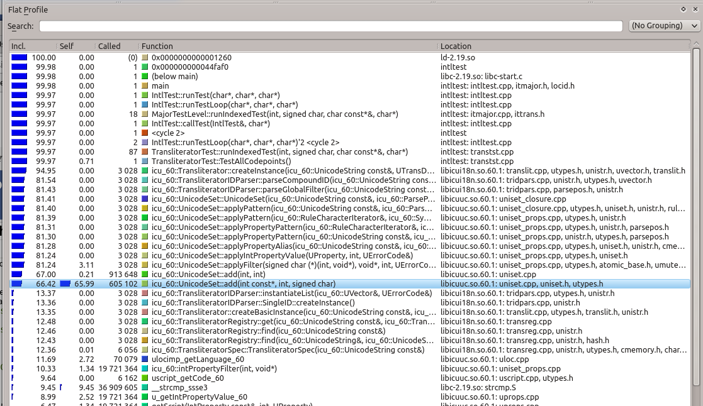
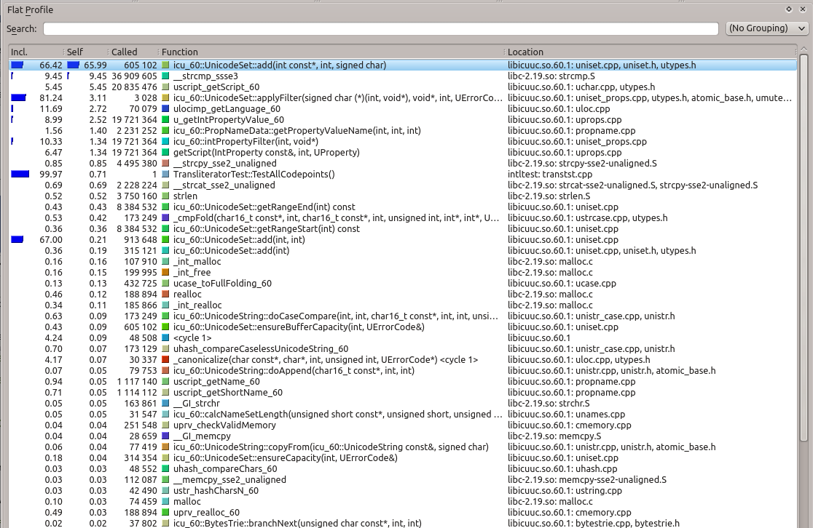
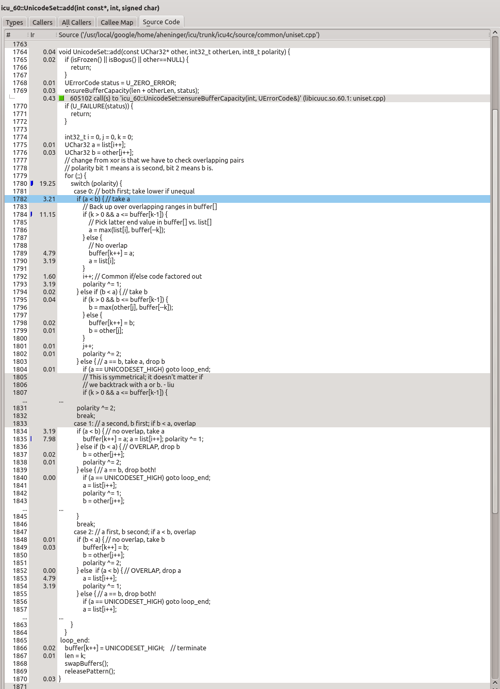

<!--
© 2016 and later: Unicode, Inc. and others.
License & terms of use: http://www.unicode.org/copyright.html
-->

# Profiling ICU4C with callgrind
{: .no_toc }

## Contents
{: .no_toc .text-delta }

1. TOC
{:toc}

---

## Prerequisites

Valgrind, callgrind and kcachegrind together proved performance profiling of C++
code, including annotated source code with time consumption at each line.

Prequisites:

* Linux with the clang compiler.
* Valgrind. If not already installed, from the command line,
  * `sudo apt install valgrind`
* kcachegrind. To install:
  * `sudo apt install kcachegrind`

Build ICU. An optimized build with debug symbols is generally best for
profiling:

```
cd icu4c/source
./runConfigureICU --enable-debug Linux
make -j6 check
```

## Run test code

Prepare the test code you wish to measure. Valgrind is very slow, so be wary of
long running tests. Because Valgrind tracks every last machine instruction (it's
not a sampling profiler), getting good results does not require a long run.

Run the test code under valgrind with callgrind. The example below runs a test
from intltest, but that is not a requirement; valgrind will profile any
executable. The differences from a normal (non-profile) invocation are
highlighted.

Without the `LD_BIND_NOW=y` the output is polluted by symbol lookups.

```
LD_LIBRARY_PATH=../../lib:../../stubdata:../../tools/ctestfw:$LD_LIBRARY_PATH
LD_BIND_NOW=y valgrind --tool=callgrind
--callgrind-out-file=callgrind.out ./intltest
translit/TransliteratorTest/TestAllCodepoints
```

The raw profiling data will be left in a callgrind.out file,

```
ls -l callgrind*
-rw------- 1 aheninger eng 325779 Oct 3 15:51 callgrind.out
```

## View in kcachegrind

Run kcachegrind to view the results.

```
kcachegrind callgrind.out
```

Explore. Lots of interesting data is available. 

[kcachegrind docs](https://kcachegrind.github.io/html/Documentation.html)

For the above run, here are the top functions, ordered by cumulative time
(including calls out) spent in each.



Time spent in each function, self time only. `UnicodeSet::add()` is hot.



Annotated source for `UnicodeSet::add()`


