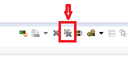

<!--
© 2016 and later: Unicode, Inc. and others.
License & terms of use: http://www.unicode.org/copyright.html
-->

# Eclipse Setup for Java Developers Using Ant
{: .no_toc }

## Contents
{: .no_toc .text-delta }

1. TOC
{:toc}

---

ICU4J source layout was changed after 4.2. There are several ways to set up the ICU4J development environment.

*If you want to use Eclipse, you should create a new clean workspace first.*

## Java Language Level

Eclipse typically requires a newer Java version than what we can depend on for
ICU4J. If you don't do the following, you run the risk of calling Java library
APIs that are newer than ICU4J's Java version, and you cause runtime exceptions
for people who use the older version.

Currently (as of 2023-sep / ICU 73), ICU4J is on Java 8 (and Eclipse 4.28/2023-06
requires Java 17).

(Note: localespi/localespi-tests may use a different Java version from ICU4J
proper.)

1.  Check if you already have an older JRE or a JDK for the minimum version
    required for ICU4J.
    *   A JRE (runtime environment, no compiler) is sufficient.
    *   If you don't have one yet, then install one (OpenJDK or Oracle).
2.  Select \[Window\] - \[Preferences\] *(On Mac, this is \[Eclipse -
    Preferences\])*
3.  Navigate the preferences tree to Java/Installed JREs/Execution Environments
4.  On the left, Execution Enviornments: Select J2SE-1.8
5.  On the right, Compatible JREs, if there is no old-version Java 8 JRE:
    1.  Go up one tree level to Java/Installed JREs.
    2.  Click "Add..." and select "Standard VM" as JRE type.
    3.  Click "Directory..." and find the location of your old-version JRE (or
        JDK) on your system
        *   Linux tip: When you install an OpenJDK, look for it in /usr/lib/jvm/
    4.  You can leave the detected settings as is - Click "Finish", then Click
        "OK" in Installed JREs (or "Apply" the modified settings as you navigate
        away from here).
    5.  Go back down in the tree to Java/Installed JREs/Execution Environments.
    6.  On the right, Compatible JREs, you should now see your old-version JRE
6.  The matching-old-version JRE should have a "\[perfect match\]" suffix.
    Select it for "JavaSE-1.8" on the left.

## Other Settings

1.  ~~Turn on warnings about resource leaks. Preferences>Java>Compiler>Errors/Warnings>\[filter on leak\], set both "Resource leak" and "Potential resource leak" to "Warning".~~
    (ICU project files were updated to include these settings, so this has no
    effects 2015-03-11)

## Import ICU4J from the file system

(Recommended)

In <icu workspace root>/icu4j remember to run "ant init" first. You might run
"ant check" as well for good measure.

If you check out ICU4J source from the repository using an external client
(usually command-line git clone), the new instruction is not much different. You
just follow the steps below -

1.  File/Import...
2.  Select General/Existing Projects into Workspace
3.  Select root directory: Browse to <icu svn workspace root>/icu4j, which will
    show a number of projects.
4.  Deselect the following projects (i.e., do not import them). These are not
    needed for normal ICU development (and would require installing further
    prerequisite libraries to get them to build).
    *   com.ibm.\* (Eclipse plug-in)
    *   icu4j-localespi\* (more plug-in)
    *   icu4j-build-tools
    *   icu4j-packaging-tests
5.  Click Finish.
6.  Wait for Eclipse to build the projects.

## Obsolete: Import ICU4J using the [Subversive](http://www.eclipse.org/subversive/) SVN plugin

Subversive is the standard SVN plugin for Eclipse 3.4+. If you have
[subversive](http://www.eclipse.org/subversive/) installed/configured on your
Eclipse environment, you can directly check out these 8 projects from the SVN
repository directory. (It looks this does not work well with
"[subclipse](http://www.eclipse.org/subversive/)")

#### Installing Subversive (Eclipse 3.6 or later)

1.  Select \[Help\] - \[Install New Software...\] from menu
2.  Select the appropriate Eclipse update site in "Work with:" field - for
    example, select "Indigo - http://download.eclipse.org/releases/indigo" for
    Eclipse 3.7.x and hit enter key.
3.  Expand "Collaboration" and check "Subversive SVN Team Provider
    (Incubation)", then click "Next >". Confirm the item selected in the next
    screen, then click "Next >" again, then accept license terms in the next
    screen and click "Finish". After the installation, click "Restart Now" to
    restart Eclipse.
4.  Select \[Window\] - \[Preferences\] to open Preferences. Expand Team on the
    left pane and click SVN. It will open "Subversive Connector Discovery".
    Select one from the list. **Note: Some people (including myself) are
    experiencing a problem with SVNKit 1.3.5. If you want to use SVNKit, use
    1.3.3 instead (2011-10-24 yoshito)** Restart Eclipse.

### Installing Subversive (Old)

1.  Goto <http://www.eclipse.org/subversive/downloads.php>
2.  Goto "latest release" on that page
3.  Copy the update site, eg
    "<http://download.eclipse.org/technology/subversive/0.7/update-site/> "
4.  Go to Eclipse, then Help > Install New Software...
5.  Into "Work with...", paste the update site.
6.  Set the checkbox on Plug-ins. Hit Next and Finish until you are done.
    Restart Eclipse.
7.  Start Eclipse. It will ask for the connectors. Select all the SVN kits and
    install. Restart Eclipse.

### Importing ICU4J

1.  File - Import
2.  Select "Project from SVN" under "SVN", Next
3.  In the General Tab, set URL to:
    svn+ssh://source.icu-project.org/repos/icu/icu4j, and set your User name:
    XXXXXX
4.  In the SSH Settings, fill-in proper authentication information. (port 922,
    your ssh key (eg icu-project-key) and passphrase..)
5.  If the connection is properly established, it opens next dialog "Select
    Resource". Set URL to be:
    svn+ssh://source.icu-project.org/repos/icu/icu4j/trunk/main - then click
    Finish
6.  The next dialog "Check Out As" should have 4 options indicating how to check
    out. Select the second option "Find projects in the children of the selected
    resource" - click Finish
7.  It takes a while to locate projects. The next dialog shows a batch of
    projects -
    1.  You may want to deselect localespi and localespi-tests.
    2.  Click Finish (that means, "Check out as a projects into workspace" is
        selected)
8.  After these projects are imported into the workspace, open Java perspective.
    You might notice there are modification marker (">") displayed for the
    projects. This is caused by build output directory created in each project's
    workspace. To resolve this issue, you can go to Window - Preferences, then
    select Team - Ignore Resources, then Add Pattern "out" (which is build
    output directory used by these projects). You may need to restart Eclipse
    after adding the new pattern.

**Note:** With the instruction above, you may see Eclipse errors when you open
ant build.xml in each project, such as "Target @build-all does not exist in this
project". This is because the import operation above flatten the original SVN
directory structure and files referenced via ${share.dir} does not work well. To
resolve the issue, you need to override the property by importing
locations-eclipse.properties globally. See the following steps to configure the
override.

1.  From Eclipse menu, select \[Window\] - \[Preferences\]
2.  Select "Ant" - "Runtime" on the left in the Preferences dialog
3.  Open "Properties" tab
4.  Under "Global property files", click "Add Files..."
5.  Select icu4j-shared project in the list, then select
    build/locations-eclipse.properties
6.  Click OK - OK, to save the configuration.

## Another method using Eclipse SVN plugin (Subversive and Subclipse)

1.  File - New - Other... then, select "Repository Location" under "SVN"
    1.  General Tab
        1.  URL - svn+ssh://source.icu-project.org/repos/icu/icu4j
        2.  User name: <yourname>
        3.  Password: <leave empty>
    2.  SSH Settings
        1.  Port: 922
        2.  Private key: <browse to your ssh private key>
        3.  Passphrase: <your passphrase>
    3.  Finish
2.  Open SVN Repositories perspective (Window>Open Perspective>SVN Repository
    Exploring) and expand the repository location you added above.
3.  Navigate to trunk
4.  Right click and select "Check Out" - this may take a few minutes.
5.  File - Import and select "Existing Projects into Workspace" under "General"
6.  Select root directory - navigate to "main" directory under your workspace
    location where the source files were checked out (for example,
    C:\\eclipse_ws\\icu4j\\trunk\\main)
7.  You should see 10 projects including icu4j-charset, icu4j-charset-tests,
    icu4j-core.... (number of projects might be changed in future)
    1.  All of them should be selected
    2.  **Important**: unclick "copy projects into Workspace"
    3.  Click Finish to import all
8.  Back in the Java perspective, you should see the new projects.
9.  For this time, projects are associated with SVN workspace. If you see the
    modification marker (">") displayed for the projects, configure your
    workspace to ignore pattern "out" (See step 7 in b-2 above).
10. From the command line, run "ant init" in the top level "main" (for example,
    C:\\eclipse_ws\\icu4j\\trunk\\main)

## Testing & Debugging

### Run All Tests

To run all of the main tests, do the following:

**58 or later**

*   "ant check" from the command line?

**53-57**

*   Select icu4j-testall project in package explorer
*   Right Click > Run As > Java Application

**52 or before**

*   In icu4j-test-testframework, open com.ibm.icu.dev.test.TestAll
*   RightClick>Run As>Java Application...
    *   It will fail, but create a Run Configuration
*   RightClick>Run Configuration...
*   Change the name to "TestAll - ICU4J"
*   Click on Arguments, and set to "-n -t"
*   Click on Classpath>User Entries>Add Projects...
*   Select all of your ICU projects but **except icu4j-localespi and
    icu4j-localespi-test**, and Add, eg:
    *   icu4j-charset
    *   icu4j-charset-tests
    *   ...
*   Now Run.

### Run specific tests

#### 58 or later

*   Right click on a test package (for example `com.ibm.icu.dev.test.rbbi` in
    the **icu4j-core-tests** project), or an entire test source directory (such
    as src in the **icu4j-core-tests** project) and choose **Run As->JUnit
    Test**
*   For test coverage, install EclEmma (below) and use **Coverage As** instead
    of **Run As**.

### Test in Eclipse with ICU4J from jar files

You can manually create an Eclipse Run Configuration that doesn't include any of
the directories but all of the JAR files:
<http://stackoverflow.com/questions/1732259/eclipse-how-to-debug-a-java-program-as-a-jar-file>

### Test Coverage (53 or later)

*   Install EclEmma plug-in. The installation instruction is found in [the
    EclEmma site page](http://www.eclemma.org/installation.html).
*   Run all tests once as described in the above section once.
*   For the menu, select "Run" > "Coverage..." to open "Coverage Configurations"
    window.
*   Go to "Coverage" tab and uncheck all test projects (icu4j-\*-tests,
    icu4j-test-framework, icu4j-testall) to exclude test codes from coverage
    analysis.
*   Click "Coverage" to run the all tests with coverage analysis enabled. After
    the text execution, coverage report displayed in "Coverage" view.
*   After running coverage, source lines are highlighted in different colors
    depending on coverage level. Too remove the highlights, click "Remove All
    Sessions" icon below (which also delete the coverage results).

*   If you want to run coverage again, you can just right click on icu4j-testall
    project and select "Coverage As" > "Java Application"

## Branching

*   // Needs review

To Create the Branch

*   Modify
*   To merge, use Team>Merge. Pick Start from Copy.

To Merge a Branch

*   ...
