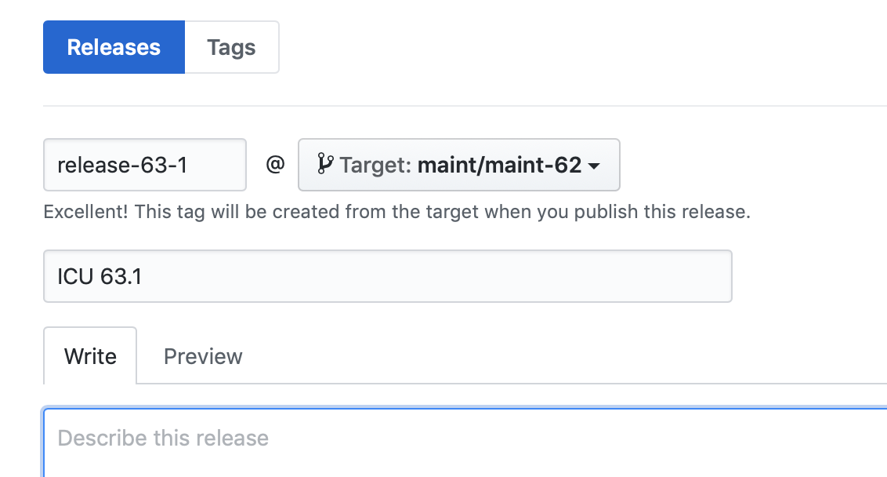

<!--
© 2021 and later: Unicode, Inc. and others.
License & terms of use: http://www.unicode.org/copyright.html
-->

# Publish
{: .no_toc }

## Contents
{: .no_toc .text-delta }

1. TOC
{:toc}OnlineDemosHowToUpdate

---

## Create a release branch in GitHub

Once the branch is created, only changes necessary for the target release are
merged in from the trunk.

---

## Upgrade LocaleExplorer and other demos/samples

... to the ICU project site.

Build the icu-demos module following the README's. Update code and/or docs as
needed. "Reference" platforms for icu-demos are: RedHat Linux and win32. On Linux,
icu-demos is built against the "make install "'ed ICU. So, run ICU4C's configure
with --prefix=/some/where pointing to where ICU4C should be installed, and also
follow icu-demos's README.

Install the new locale explorer and other demos/samples onto the public demo
hosting site.

---

## ICU Collation Demo

Update the ICU collation demo's `index.html` with the new ICU version’s
available collators.

1.  Do a clean build (configure, make clean, make install, make check).
    1.  Otherwise, the data build may not pick up a new locale into the
        coll/res_index.txt file.
2.  Run [icu-demos >
    webdemo/collation/build.sh](https://github.com/unicode-org/icu-demos/blob/main/webdemo/collation/build.sh)
    (after modifying it for your system).
3.  Copy-paste the output `available-collators.txt` into `index.html`.
    1.  Or, easier: Use a GUI difftool (e.g., meld) to compare the two and move
        the changes into index.html.
    2.  `meld webdemo/collation/index.html ../available-collators.txt`
4.  See for example the changes for
    [ICU-11355](https://unicode-org.atlassian.net/browse/ICU-11355)

For details see the comments at the start of the build.sh file.

---

## Repository Branch and Tags

⚠ Careful! The following examples contain specific version, revision and ticket
numbers. Adjust them for the current release! Easiest: Paste into an editor,
fix, then paste into the terminal.

### Creating Maintenance Branch.

Sanity check: Update to the latest repository revision. (Main branch if you
copy from main, maintenance branch if you copy from there.)

```sh
git checkout main 
git pull upstream main 
git log -n1 
commit bcd0... (HEAD -> main, upstream/main, ...)
```

Ensure that your local branch is in sync with the upstream branch. Make sure you
are checking the upstream remote, and not your fork!

Build & test ICU4C & ICU4J on your machine.

Create the maintenance branch from the current known good main ref.

```sh
git checkout -b maint/maint-63 
git push -u upstream maint/maint-63
```

#### Tagging

Use the GitHub GUI to create both the "release" and the "tag" at the same time:

<https://github.com/unicode-org/icu/releases/new>

Fill in the tag name, such as "release-63-rc" or "release-63-1", and make the
target the "maint/maint-xx" branch (such as maint/maint-63).

Set the title to "ICU 63 RC" or "ICU 63.1". Fill in the description using the
text from the announcement email. (You can also look at previous releases and
possibly re-use some of the generic text, such as links to the API docs, etc.)

Your screen should look like this:



For the release candidate tag, please check the box that says "Pre-Release".

We no longer need to add the note about Git LFS files, as GitHub now includes
them in the auto-generated .zip downloads.

Click the "Publish Release" button to make the tag.

Note: The "latest" tag is no longer updated. It was agreed by the ICU-TC to be
deleted around the 64.2 time-frame, as it doesn't work well with with Git. (You
need to force-push the new tag, and if somebody has already cloned the
repository, they might have something different for the "latest" tag).
A possible future alternative might be a sym-link folder, or HTTP redirect that
points to the latest release.

#### Maintenance release

Create the maintenance release tag from the maintenance branch, as above.

Update the "latest" tag.

### ~~ICU 58 and earlier~~

~~Tag related svn files, for **icu**, **icu4j** and (for final releases)
**tools** file trees. We tag the tools tree so that we can reproduce the Unicode
tools that were used for the Unicode data files in this release.~~

~~For a Release Candidate, just tag, don't branch, and only tag icu & icu4j.~~

~~For the final release, branch then tag. Copy the trunk to maint/maint-4-8 and
copy that to tags/release-4-8. Specify the source revision explicitly via -r so
that you don't inadvertently pick up an unexpected changeset. Make sure that the
trunk at the source revision is good.~~

~~We do not tag the data & icu-demos trees. Steven Loomis writes on 2011-may-23:~~

> ~~My thought had been (in the CVS days) to take a 'snapshot' of these items.
> However, in SVN all you need is a date or a revision number (such as
> r30140).~~

> ~~So, probably, we don't need to tag these two (idu-demos or data).~~

> ~~Tools are more important because those tools are actually used in the
> release.~~

### Create ICU download page

Create the download page before the first milestone, if we have one, or before
the release candidate.

Log into the ICU homepage Google Site. (If you don't have write access, ask one
of the editors to grant you access.)

Verify that there is not already a page for the upcoming release: Either via the
sitemap, or on the bottom of the main download page where it says something like
"Subpages (27): View All".

Copy the download page for the last release: Go to that page, gear menu, Copy
page; "Name your page" using just the major version number for now (e.g., "61")
so that the page URL is just that number, select "Put page under Downloading
ICU", click the red COPY button.

Adjust the new page as needed: Change the title to "Download ICU 61 Release
Candidate" (with the right version number...), remove contents specific to the
previous release, update all version numbers, update all links.

Put a big, bold+italics, red warning at the top like "This version has not been
released yet. Use it for testing but not in production!"

Save the page. It is generally a good idea to save frequently. For further
edits, simply go back into edit mode. (Keyboard shortcut 'e' for edit, ctrl+s
for save.)

Add new contents for the upcoming release: Grab some text from the sibling
Unicode and CLDR release notes, look at the proposal status doc for this
release, make a pass through the api/enhancement tickets fixed in this release
or under reviewing/reviewfeedback.

Look at the download pages of the last two releases for templates for things
like a Migration Issues section etc.

Ask everyone on the team to add stuff & details.

**Once the page has been created and various people are invited to edit it,
everyone should keep editing short so that the page is not locked for others for
long periods of time.**

### Maintenance release

For a maintenance release, look at the ICU 60 page which includes 60.2.

---

## Milestone on the main download page

We had the following HTML on the main download page for ICU 4.8M1 = 4.7.1:

```html
<h3 style="background-color:rgb(102, 102, 102);color:white;margin-bottom:0pt;margin-top:12pt;padding-left:0.75em;font-size:1em;font-family:Arial,Helvetica,sans-serif">Development Milestones</h3>
<table border="0"><p style="font-size:10pt;font-family:Arial,Helvetica,sans-serif">Development milestone versions of ICU can be downloaded below. A development milestone is a stable snapshot build for next ICU major version.  These binaries and source code are provided for evaluation purpose and should be not be used in production environments.  New APIs or features in a milestone release might be changed or removed without notice.&nbsp;</p>
<tbody>
<tr>
<td style="width:105px;height:16px">&nbsp;<b>Release</b></td>
<td style="width:792px;height:16px">&nbsp;<b>Major Changes<br>
</b></td>
</tr>
<tr>
<td style="width:105px;height:29px">&nbsp;<a href="https://sites.google.com/site/icusite/download/471">4.8M1 (4.7.1)</a><br>
</td>
<td style="width:792px;height:29px">&nbsp;CLDR 1.9.1+, Parent locale override, Dictionary type trie, Alphabetic index (C), Compound text encoding (C), JDK7 Locale conversion (J)<br>
</td>
</tr>
</tbody>
</table>
</span><br>
```

---

## Upload Release Source / Binaries

Download Directories are located at, for example,
`icu-project.org:/home/htdocs/ex/files/icu4c/4.4.2`
corresponding to <http://download.icu-project.org/ex/files/icu4c/4.4.2/>
Look at previous releases for an example.

### Java Source/Bin:

Follow instructions here: [Building ICU4J Release Files](../release-build.md)

### C source/binary:

<span style="background:yellow">***WORK IN PROGRESS***</a>

#### Source and Linux Binaries:

Important: this step works with Unix make + docker.

First, install *docker* and *docker-compose. D*o not proceed until *docker run
hello-world* works!

```sh
$ git clone https://github.com/unicode-org/icu-docker.git
$ cd icu-docker/src
$ git clone --branch release-64-rc --depth 1 https://github.com/unicode-org/icu.git
$ cd icu
$ git lfs fetch
$ git lfs checkout
$ cd ../..
$ less [README.md](https://github.com/unicode-org/icu-docker/blob/main/README.md)  # Follow these instructions.
```

*   Source and binaries are created in ./dist/.
*   The names [don't match what's needed on
    output](https://github.com/unicode-org/icu-docker/issues/1) so be sure to
    rename.

**Note:** If you only want to make a source tarball (.tgz/.zip), then you can
run \`make dist\`.

*   This will produce a source tarball and will include a pre-compiled .dat file
    under icu4c/source/data/in/.
*   Note: This tarball will also omit all of the data sub-directories containing
    locale data.
*   Note that the source is taken from the git repository itself, and not your
    local checkout. (Thus it will exclude any local uncommitted changes).

#### Windows Binary:

*   Manual process:
    *   Build with MSVC x64 Release. (See the ICU
        [readme.html](https://github.com/unicode-org/icu/main/blob/icu4c/readme.html)
        file for details).
    *   Open a command prompt.
        ```
        cd C:\icu\icu4c\ (or wherever you have ICU located).
        powershell
        Set-ExecutionPolicy -Scope Process Unrestricted
        .\packaging\distrelease.ps1 -arch x64
        ```
        This will produce the file "source\dist\icu-windows.zip", which will
        need to be renamed before uploading.
        *   For example, the binaries for ICU4C v61.1 generated with VS2017 were
            named "icu4c-61_1-Win64-MSVC2017.zip".
        *   Note: As of ICU 68, the pre-built binaries use MSVC2019 instead of
            MSVC2017.
*   Using the output from the build bots:
    *   Navigate to the GitHub page for the commits on the
        `maint/maint-<version>` branch.
        *   Ex: https://github.com/unicode-org/icu/commits/maint/maint-64
    *   Click on the green check mark (✔) on the most recent/last commit. (It
        might be a red X if the builds failed, hopefully not).
        *   This will open up a pop-up with links to various CI builds.
    *   Click on one of the various links that says "Details" for the Azure CI
        builds.
        *   This will open up the GitHub overview of the build status.<br>
            <br>
    *   Click on the link "View more details on Azure Pipelines" link.
        *   This will take you to the actual Azure CI build page.
    *   On the top right of the page there should be a button titled
        "Artifacts". Click this and it should show a drop-down with various ZIP
        files that you can download.<br>
        <br>
    *   The ZIP may automatically download for you.
    *   However, if you are signed-in to visualstudio.com then you might see a
        dialog titled "Artifacts explorer".
    *   In this case click on the name, then the "..." button to download the
        zip file.<br>
        <br>
    *   Download both the x64 (64-bit) and x86 (32-bit) ZIP files.
    *   For each architecture:
        *   Extract the Zip file. (It will have a name like
            "20190829.6_ICU4C_MSVC_x64_Release.zip").
        *   Navigate into the folder with the same name.
        *   Rename the file "icu-windows.zip" to the appropriate name:
            *   Ex: The x64 zip for version 64.1 was named
                "icu4c-64_1-Win64-MSVC2017.zip"
            *   Ex: The x86 zip for version 64.1 was named
                "icu4c-64_1-Win32-MSVC2017.zip"
            *   Note: Note: As of ICU 68, the pre-built binaries use MSVC2019
                instead of MSVC2017.
        *   Note: For RC releases the name looked like this:
            "icu4c-64rc-Win64-MSVC2017.zip"
*   ~~AIX Bin:~~ (AIX is broken and ignored for now.)
    *   ~~login to gcc119.fsffrance.org and copy the ICU4C source archive
        created above to there.~~
    *   ~~$ gzip -dc icu4c-XXX-src.tgz | tar xf -~~
    *   ~~$ cd icu~~
    *   ~~$ PATH=/opt/IBM/xlC/13.1.3/bin:$PATH source/runConfigureICU AIX~~
    *   ~~(The above command line doesn't actually work, see [ICU Ticket
        ICU-13639](https://unicode-org.atlassian.net/browse/ICU-13639) for a
        workaround.)~~
    *   ~~$ gmake DESTDIR=/tmp/icu releaseDist~~
    *   ~~That last step will create a directory in **/tmp/icu** - zip that up
        to make the release.~~
    *   ~~In case /tmp happens to be full, see the [mailing list
        archive](https://sourceforge.net/p/icu/mailman/message/36275940/) for
        advice.~~

#### Output of icuexportdata:

This step publishes pre-processed Unicode property data, which may be ingested by downstream clients such as ICU4X.

*   Using the output from the build bots:
    *   Navigate to the Azure Pipeline `C: Create Artifacts from icuexportdata` and download its single artifact (`icuexportdata_output`)
    *   Unzip the file
    *   Rename the `icuexportdata_tag-goes-here.zip` file to the correct tag (replacing slashes with dashes)

### Signing archives and creating checksums:

#### Step 1. PGP files:

Sign all archives created above with your own personal PGP key. This creates a
file with .asc as the suffix.

```sh
$ gpg --armor --detach-sign icu4c-xxx-xxx.zip
# To verify
$ gpg --verify icu4c-xxx-xxx.zip.asc
```

#### Step 2. MD5 files:

Use md5sum or [cfv](http://cfv.sf.net) to create [md5](https://en.wikipedia.org/wiki/MD5) hash sums for three groups of files:

*   icu4j (all files),
*   icu4c (source),
*   icu4c (binaries).

Using md5sum to create and verify the checksum files:

<pre><code><b><b>md5sum source1 source2 ... sourceN &gt; icu4c_sources.md5</b></b> # To verifymd5sum -c icu4c_sources.md5 
</code></pre>

Alternatively, use cfv to create and verify md5 files:

```sh
cfv -t md5 -C -f icu-……-src.md5 somefile.zip somefile.tgz …
# To verify 
cfv -f icu-……-src.md5
```

#### Step 3. SHASUM512.txt

Create an additional hash sum file SHASUM512.txt file with:

```sh
shasum -a 512 *.zip *.tgz | tee SHASUM512.txt
```

This file should also be GPG signed. Check the .asc with \`gpg verify\`.

### Update the Download Page Gadgets

Update the gadgets on the download page to point at the new URL for the
binaries.

1.  Edit the download page.
2.  Click on the Gadget area.
3.  Click on the "gear" icon.
4.  Update the URL field with the new URL.
    1.  For example: The ICU4C 63.1 Binaries URL was:
        <http://apps.icu-project.org/icu-jsp/downloadSection.jsp?ver=63.1&base=c&svn=release-63-1>

#### Check the ICU public site for the new release

Make sure that, aside from download pages, homepages, news items, feature lists
and feature comparisons, etc. are updated. Upload the new API references. Update
the User Guide.

#### Update the Trac release number list for ICU4C and ICU4J. <<?? STILL VALID ??>>

Update the ICU release number list by going to "Admin>Versions" in Trac, and add
the new ICU version.

#### Post-release cleanup

*   Cleanup the milestone in the ICU Trac. Move left over items to future
    milestones. Close the milestone.
*   Look for TODO comments in the source code and file new tickets as required.
*   Delete and retag
    [latest](http://source.icu-project.org/repos/icu/tags/latest/) (**ONLY**
    after GA release, including maintenance!) << IS THIS STILL VALID WITH GIT?
    >>

---

## Update online demos

These are the online demos/tools that need to be updated to the latest version.

* Be sure to verify that the deployed version is publicly available.

Note that updating ICU4C demos online requires Gcloud access.

### ICU4C demos
* [Run ICU4C demos](https://icu4c-demos.unicode.org/icu-bin/idnbrowser)

* [Demo described here](https://github.com/unicode-org/icu-demos/blob/main/README.md)

* [Building and deploying from GCloud](https://github.com/unicode-org/icu-demos//blob/main/README.md)

### ICU4J demos

* [Run ICU4J online demos](https://icu4j-demos.unicode.org/icu4jweb/)

* [Information on the Java demos and samples](https://icu.unicode.org/home/icu4j-demos)

* [Instructions for building and deploying updates](https://github.com/unicode-org/icu-demos/blob/main/icu4jweb/README.md)


### Online information update

Collation and [comparison](../../../../charts/comparison/index.md) charts need
to be updated. See [charts/Performance & Size](../../../../charts/index.md).

### Old sensitive tickets

Unset the "sensitive" flag on old tickets. For example, on tickets that were
fixed two or more releases ago.

[Sample ticket query for ICU 65, for tickets fixed in 63 or
earlier](https://unicode-org.atlassian.net/issues/?jql=project%20%3D%20ICU%20AND%20Level%3DSensitive%20AND%20fixVersion%20not%20in%20(65.1%2C%2064.2%2C%2064.1)%20AND%20status%3DDone).
Adjust the fixVersion selection as appropriate. Check the list in the ICU
meeting.

Check duplicates and fixedbyotherticket! Keep the "sensitive" flag on tickets
that were closed as duplicates of other tickets that are not yet fixed or have
been fixed only very recently.

For removing the flag:

*   Enter bulk edit. Select all query results.
*   Uncheck duplicates of unfixed or too-recent tickets.
*   Edit fields:
    *   Security Level = None
    *   Add label "was_sensitive"
    *   No notification emails
*   Confirm bulk edit.

---

## Punt tickets

Double-check that tickets with commits in this release are closed/fixed. Close
as needed. (Hopefully none misticketed at this point...)

Then punt remaining tickets marked for this release:

1.  In Jira, search for all tickets with Project=ICU, Fix Version=<this
    release>, Status≠Done.
2.  Go to Bulk Edit ("..." menu in the upper right corner)
3.  Select all
4.  Edit fields:
    1.  Fix Version: replace all with "future"
    2.  Labels: add "punt<this release>" (e.g., "punt63")
    3.  No email notifications
5.  Confirm bulk edit
6.  Send a courtesy email to the team with a Jira query URL for the
    Label="punt<this release>" tickets.

After punting, please also update the "To-Do for Next ICU Release" widget on
Jira.

1.  Open <https://unicode-org.atlassian.net/issues/?filter=10007>
2.  Use the drop-down to change the fix version to the next ICU version
3.  Click "Save" next to the filter title

## Update readme

Update [ICU4C
readme.html](https://github.com/unicode-org/icu/main/icu4c/readme.html)
and [ICU4J
readme.html](https://github.com/unicode-org/icu/main/icu4j/readme.html)
before every milestone (GA / RC / Milestone-N). Make sure the following items
are up to date.

*   Release version
*   Last update date
*   Description - descriptions for GA, RC and Milesone-N are already included in
    the readme file.
    *   Comment/uncomment parts as appropriate.
    *   If the readme should remain the same between milestones, we can skip
        directly to the GA description. Otherwise, pick the right one for the
        release type.
    *   **Since ICU 67, we have skipped from GA to GA**, without marking &
        unmarking the readme specifically for the release candidate.
*   Build steps - make sure supported compiler versions are up to date
