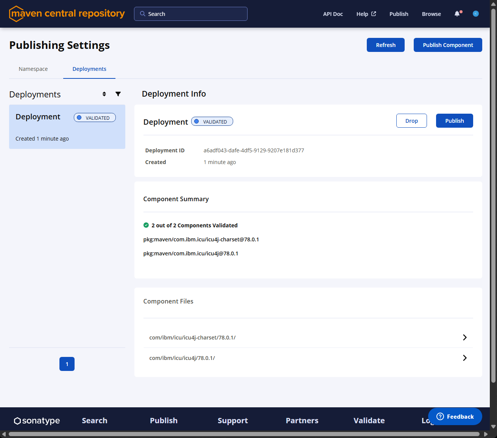
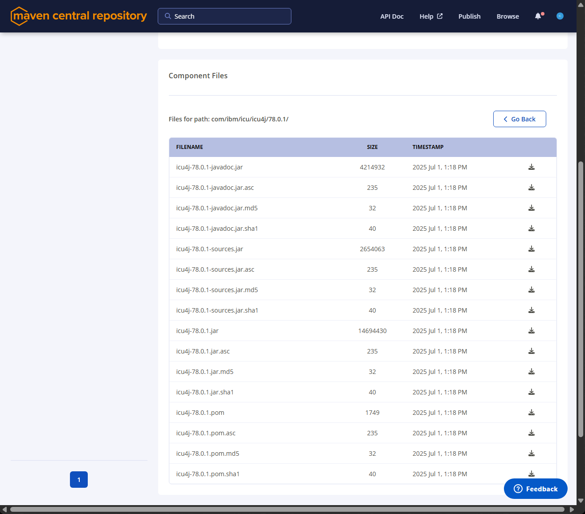

<!--
© 2024 and later: Unicode, Inc. and others.
License & terms of use: http://www.unicode.org/copyright.html
-->

# Publish - Since Version 76.1
{: .no_toc }

## Contents
{: .no_toc .text-delta }

---

## Most artifacts are now built in the GitHub CI

Many of the tasks that used to be done before "by hand" are now at least
partially done by GitHub Actions.

The release requires (for now) triggering the actions "by hand".

First go to [Github - unicode-org/icu](https://github.com/unicode-org/icu).

### Create a release

Create a release, give it a tag (something like `release-76` or `release-74-2`) \
Make sure the release is **DRAFT**.

See [Release & Milestone Tasks - Tagging](index.md#tagging) for details.

That tag will need to be passed to several of the actions below.

**For ICU releases** the tag convention is `release-<icuFullVersion_withDots>`,
for example `release-79.1` or `release-79.0.1` or even `release-79.1rc2`. \
The branch is `maint/maint-<icuMajorVersion>`, for example `maint/maint-79`.

**For ICU4X releases** the tag convention is `icu4x/<isoDate>/<icuMajorVersion>.x`,
for example `icu4x/2026-08-27/79.x`. \
The branch is `main`.

### Run the release workflows

Go to [Github - unicode-org/icu](https://github.com/unicode-org/icu) -- Actions
and select the action to run from the left side.

Select an action and (from the right side) select "Run workflow".

Some actions will have an "Run the tests." option. \
**KEEP IT ON!** It is there for development, but you MUST run the tests for release.

Most will have a "Release tag to upload to." option.
Use the one you just created (see previous section).

> :point_right: For ICU4X Releases you only need to run the last 2 sub-actions:
> _"GHA ICU4X - ICU Export Data (`icu4x_icuexportdata.yml`)"_ and
> _"Release - Create checksums and GPG sign"_ (see the list below).
>
> For versions before August 30, 2026, you must run
> _"GHA ICU4C - Before 79.1 (`icu4c.yml`)"_ instead of 
> _"GHA ICU4X - ICU Export Data (`icu4x_icuexportdata.yml`)"_

Also, see ["Start the artifact building actions from CLI"](#start-from-cli) at the bottom.

1. **Release - All ICU** (`release-all.yml`) - Since Version 79.1. \
   This will trigger all the workflows necessary for an ICU release. \
   Keep `runTests` checked, check `deployToMaven`, and set `gitReleaseTag`. \
   The individual actions are described below. They can still be executed
   separately for debugging.

   1. **GHA ICU4C** - Before 79.1 (`icu4c.yml`) \
    This will create and add to release: \
       * The Windows binaries (`icu4c-{icuver}-Win32-MSVC20??.zip`,
       `icu4c-{icuver}-Win64-MSVC20??.zip`, `icu4c-{icuver}-WinARM64-MSVC20??.zip`)
       * The packaged data for ICU4X (`icuexportdata_tag-goes-here.zip`)

   2. **GHA ICU4C - MS VC Dist Release** - Since 79.1 (`icu4c_msvcdistrelease.yml`) \
      This will create and add to release: \
      * The Windows binaries (`icu4c-{icuver}-Win32-MSVC20??.zip`,
      `icu4c-{icuver}-Win64-MSVC20??.zip`, `icu4c-{icuver}-WinARM64-MSVC20??.zip`)

   3. **Release - ICU4C artifacts on Fedora** (`release-icu4c-fedora.yml`) \
      This will create and add to release:
      * `icu4c-{icuver}-Fedora_Linux??-x64.tgz`.

   4. **Release - ICU4C artifacts on Ubuntu** (`release-icu4c-ubuntu.yml`) \
      This will create and add to release:
      * The `icu4c-{icuver}-Ubuntu??.04-x64.tgz` file
      * The icu4c data files (`icu4c-{icuver}-data.zip`,
        `icu4c-{icuver}-data-bin-b.zip`, `icu4c-{icuver}-data-bin-l.zip`)
      * The icu4c source archives (`icu4c-{icuver}-src.tgz` and `icu4c-{icuver}-src.zip`)
      * The ICU4C documentation (`icu4c-{icuver}-docs.zip`) \
      **WARNING:** this is also the one to be published (unpacked) for web access

   5. **Release - ICU4J publish to Maven Central** (`release-icu4j-maven.yml`) \
      This will create, publish to Maven Cental (using Sonatype), and add to release:
      * All the official Maven artifacts, including sources and javadoc. \
        The Maven Central artifacts have checksums and are digitally signed. \
        Someone with access to Sonatype Nexus should still login there and authorize
        the promotion to Maven Central.
      * The unified Java documentation, (`icu4j-{icuver}-fulljavadoc.jar`) \
        **WARNING:** this is also the one to be published (unpacked) for web access
      * Make sure to set the proper parameters:
        * **Branch:** the branch prepared for release, for example `maint/maint-77`
        * **Run the tests:** checked (default)
        * **Deploy to Maven Central:** check (unchecked by default), if you are ready
          for a real deployment and not doing just a sanity check
        * **Release tag to upload to:** should be the GitHub draft release prepared
          in a previous BRS step.

   6. **GHA ICU4X - ICU Export Data** - Since 79.1 (`icu4x_icuexportdata.yml`) \
      This will create and add to release: \
      * The packaged data for ICU4X (`icu4x-icuexportdata-<tag-goes-here>.zip`)

   7. **Release - Create checksums and GPG sign** (`release-check-sign.yml`) \
      THIS SHOULD BE THE LAST ACTION YOU RUN. \
      After all the artifacts from the previous steps are posted to the release. \
      The action will download all the artifacts from release,
      create checksum files (`SHASUM512.txt` and `*.md5`),
      and digital signature files (`*.asc`)

### Sonatype: sanity check and approve the push to Maven Central

The previous step stages the Maven artifacts to Sonatype, but does
not automatically push them to Maven Central. \
It can be enabled, but we chose no to enable it by default so that a human can do a last sanity check. \
So someone must login to Sonatype, check that everything looks fine, and approve.

<span style="color:red"><b>Note:</b> only someone with a Sonatype account
that was authorized for `com.ibm.icu` can approve. \
You can find the list of people with such access in the team shared folder.</span>

To do that:

* log on to the [Sonatype Central Portal -- Namespaces](https://central.sonatype.com/publishing/namespaces).
* Select the **Deployments** tab.
 
* Check the files staged there (`icu4j-charset` is similar):
 
* Compare to a previous public release in Maven Central
(for example [ICU4J 77.1](https://repo1.maven.org/maven2/com/ibm/icu/icu4j/77.1/)
and [ICU4J Charset 77.1](https://repo1.maven.org/maven2/com/ibm/icu/icu4j-charset/77.1/)) \
And do a sanity check:
  * make sure there are no errors / warnings
  * the timestamps look reasonable
   (close to the time when the ICU4J publish GitHub action finished),
  * the version is the one you expect to release
  * the file sizes didn't drastically change from the previous release
* Once you confirm that everything looks reasonable, approve the deployment
 (click **Publish**).

<a name="start-from-cli"></a>
### Start the artifact building actions from CLI

An alternative is to trigger the GitHub release workflows from command line.

### Files for the API web documentation

From the release assets download `icu4c-{icuver}-docs.zip` and
`icu4j-{icuver}-fulljavadoc.jar`.

You should use these files for the API documentation web publishing, see
[APIs & Docs (docs.md) -- Build API documentation](../docs.md#build-api-documentation).

### Releasing ICU - Starting with 79.1

```sh
REPO=unicode-org/icu
BRANCH=maint/maint-79
RELEASE_TAG=release-79.1

gh workflow run release-all.yml \
  -f gitReleaseTag=${RELEASE_TAG} \
  -f deployToMaven=true \
  --ref ${BRANCH} --repo ${REPO}
```

### Releasing ICU - Before 79.1

```sh
REPO=unicode-org/icu
BRANCH=maint/maint-78
RELEASE_TAG=release-78.1

gh workflow run icu4c.yml \
  -f gitReleaseTag=${RELEASE_TAG} \
  --ref ${BRANCH} --repo ${REPO}
gh workflow run release-icu4c-fedora.yml \
  -f gitReleaseTag=${RELEASE_TAG} \
  --ref ${BRANCH} --repo ${REPO}
gh workflow run release-icu4c-ubuntu.yml \
  -f gitReleaseTag=${RELEASE_TAG} \
  --ref ${BRANCH} --repo ${REPO}
gh workflow run release-icu4j-maven.yml \
  -f gitReleaseTag=${RELEASE_TAG} \
  -f deployToMaven=true \
  --ref ${BRANCH} --repo ${REPO}

# WAIT for all actions above to successfully finish

gh workflow run release-check-sign.yml \
  -f gitReleaseTag=${RELEASE_TAG} \
  --ref ${BRANCH} --repo ${REPO}
```

### Releasing ICU4X export data

```sh
REPO=unicode-org/icu
BRANCH=main
RELEASE_TAG=icu4x/2026-08-27/79.x

gh workflow run icu4x_icuexportdata.yml \
  -f gitReleaseTag=${RELEASE_TAG}
  --ref ${BRANCH} --repo ${REPO}

# WAIT for the above action to successfully finish

gh workflow run release-check-sign.yml \
  -f gitReleaseTag=${RELEASE_TAG} \
  --ref ${BRANCH} --repo ${REPO}
```

The login to Sonatype and approval should still be done "by hand", no CLI.
