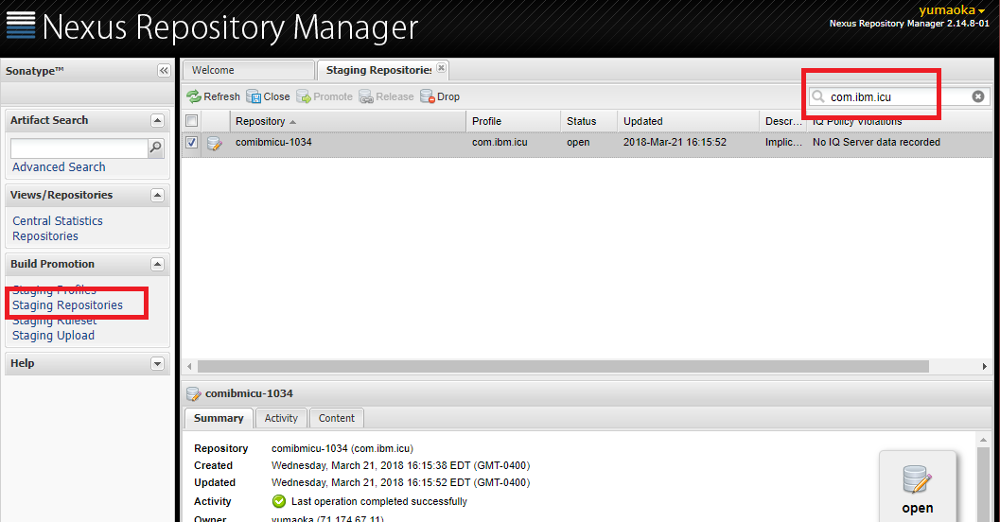

<!--
© 2021 and later: Unicode, Inc. and others.
License & terms of use: http://www.unicode.org/copyright.html
-->

# Release Build
{: .no_toc }

## Contents
{: .no_toc .text-delta }

1. TOC
{:toc}

---

## Building ICU4J Release Files

<span style="color:red">*Note: This instruction is reviewed for ICU4J 69.1. Some
description may not apply to previous ICU releases. ICU4J library (as of ICU 69)
supports JRE 7 or later Java runtime environment. To avoid the Java's system
library class's backward compatibility problem, ICU4J binary files must be
compiled with Java system libraries from JRE 7.*</span>

## Prerequisites

*   Java SE Development Kit 8 (to run ant, javac, javadoc..)
*   Java Runtime Environment 7 (used as bootclasspath for cross-compilation)
*   Apache Ant 1.10.x (the latest available version)
    \[<http://ant.apache.org/>\]

### Other Prerequisites only for GA

*   Maven Ant Tasks 2.1.3 (GA only) \[<http://maven.apache.org/ant-tasks>\]
    (Note: This is component is no longer maintained, and ICU project should
    update the process in near future)
*   gpg (GNU Privacy Guard)
    *   ICU Project PGP key (icuintl@us.ibm.com - [published to MIT key
        server](https://pgp.mit.edu/pks/lookup?op=vindex&search=0x44CE7BF2825EA2CD))
*   Sonatype Nexus Repository Manager account for managing artifacts
    com.ibm.icu.\* on OSSRH (Reference: [OSSRH
    Guide](http://central.sonatype.org/pages/ossrh-guide.html))

    <span style="color:red">*Note: Contact Yoshito for the PGP key and Sonatype
    account.*</span>

### Configuration

*   Set environment variable `JAVA_HOME` to point to the JDK directory.
*   See `build.properties` to check version strings are properly set.
    *   `api.report.version` / `api.report.prev.version` are used for locating
        API signature files and should be integer numbers.
    *   `release.file.ver` is used as a part of build output file name.
    *   `api.doc.version` is used for the API document title
    *   `mavne.pom.ver` is used in pom.xml when release files are uploaded to
        OSSRH

        For ICU 69.1 GA, the contents of the properties file should be:
        ```
        api.report.version = 69
        api.report.prev.version = 68
        release.file.ver = 69_1
        api.doc.version = 69.1
        maven.pom.ver = 69.1
        ```

*   Create `build-local.properties` in the ICU4J root directory

*   Edit `build-local.properties` to add a property - `java7.bootclasspath
    (java6.bootclasspath for ICU57 to ICU62)`

    The value of javaX.bootclasspath should include JRE's system library path. A
    set of jar files included in the system library path may vary depending on
    JRE vendor (Oracle, OpenJDK and IBM use different set of jars) and version.
    The easiest way to get the system library path is to run a simple Java
    program on the target JRE.

        System.out.println(System.getProperty("sun.boot.class.path"));

    For example, the values on my Linux system (Ubuntu) look like below:

        java7.bootclasspath=/home/yoshito/jdk/oracle/jdk1.7.0_80/jre/lib/resources.jar:/home/yoshito/jdk/oracle/jdk1.7.0_80/jre/lib/rt.jar:/home/yoshito/jdk/oracle/jdk1.7.0_80/jre/lib/sunrsasign.jar:/home/yoshito/jdk/oracle/jdk1.7.0_80/jre/lib/jsse.jar:/home/yoshito/jdk/oracle/jdk1.7.0_80/jre/lib/jce.jar:/home/yoshito/jdk/oracle/jdk1.7.0_80/jre/lib/charsets.jar:/home/yoshito/jdk/oracle/jdk1.7.0_80/jre/lib/jfr.jar:/home/yoshito/jdk/oracle/jdk1.7.0_80/jre/classes

    One Windows system, path separator back slash '\\' should be replaced with
    forward slash '/'. For example:

        java7.bootclasspath=C:/jdk/oracle/7u80/jre/lib/resources.jar;C:/jdk/oracle/7u80/jre/lib/rt.jar;C:/jdk/oracle/7u80/jre/lib/sunrsasign.jar;C:/jdk/oracle/7u80/jre/lib/jsse.jar;C:/jdk/oracle/7u80/jre/lib/jce.jar;C:/jdk/oracle/7u80/jre/lib/charsets.jar;C:/jdk/oracle/7u80/jre/lib/jfr.jar;C:/jdk/oracle/7u80/jre/classes

### Additional Configuration for GA

*   Add 2 more properties to `build-local.properties`
    *   `maven-ant-tasks.jar` - Specify the path to the Maven Ant Tasks jar
        file.
    *   `gpg.user` - Specify the ICU Project PGP key user name

    For example, build-local.properties look like below:

    ```
    java7.bootclasspath=/home/yoshito/jdk/oracle/jdk1.7.0_80/jre/lib/resources.jar:/home/yoshito/jdk/oracle/jdk1.7.0_80/jre/lib/rt.jar:/home/yoshito/jdk/oracle/jdk1.7.0_80/jre/lib/sunrsasign.jar:/home/yoshito/jdk/oracle/jdk1.7.0_80/jre/lib/jsse.jar:/home/yoshito/jdk/oracle/jdk1.7.0_80/jre/lib/jce.jar:/home/yoshito/jdk/oracle/jdk1.7.0_80/jre/lib/charsets.jar:/home/yoshito/jdk/oracle/jdk1.7.0_80/jre/lib/jfr.jar:/home/yoshito/jdk/oracle/jdk1.7.0_80/jre/classes
    maven-ant-tasks.jar = /home/yoshito/java-libs/maven-ant-tasks/maven-ant-tasks-2.1.3.jar
    gpg.user = ICU Project
    ```

    <span style="color:red">*Note: Maven Ant Tasks is no longer maintained. ICU team should find out another method to publish ICU artifacts to the repository (ticket [ICU-12811](https://unicode-org.atlassian.net/browse/ICU-12811)).*</span>

*   Create maven local setting file `$HOME/.m2/settings.xml` if absent. Then add
    the Sonatype Nexus Repository Manager account information in the file. For
    example:
    ```xml
    <settings>
      <servers>
        <server>
          <id>icu4j-releases</id>
          <username>yumaoka</username>
          <password>OSSRH-SonaType-Password</password>
        </server>
        <server>
          <id>icu4j-snapshots</id>
          <username>yumaoka</username>
          <password>OSSRH-SonaType-Password</password>
        </server>
      </servers>
    </settings>
    ```

### Building Release Files for Milestones/Release Candidates

1. Checkout tagged version - Use clean checkout of Git (SVN up to ICU62) tag
   (e.g. release-61-0-1, release-61-rc..) for building release files.
2. Run `$ ant releaseVer` - This build target generates ICU release files with
   version number in a folder `release` under the ICU4J root directory.

   This ant target prints out warning messages as below if the build system is
   not properly configured.
   ```
   _verify_config_for_release:
      [echo] ################################################################
      [echo] [WARNING] Insufficient Build Configuration for ICU4J Release
      [echo] JDK Tools Version: 1.8.0_152
      [echo] JRE 7 System Library Path: Not Defined!
      [echo] ################################################################

   BUILD SUCCESSFUL
   Total time: 5 minutes 31 seconds
   ```
   If you see such warnings at the end of build log, fix the issue and run the
   target again.
3. Upload all files generated under the `release` directory to the ICU site.

## Building Release Files for Final Release (GA)

A final (official) release files will be posted to the Maven Central Repository
as well as the ICU project site. The build target `releaseFinal` generates all
necessary files for the Maven repository and upload them after regular release
build target is executed.
1. Checkout tagged version - Use clean checkout of Git (SVN up to ICU62) tag
   (e.g. release-61-1, release-61-2) for building release files.
2. Run `$ ant releaseVer` once to make sure there are no build configuration
   issues. Run `$ ant clean` to clean up build.
3. \[Optional\] In the next step, the build target invokes gpg to generate
   signature of build output files. gpg will request you to type in the
   passphrase for the ICU Project (icuintl@us.ibm.com) PGP key once. gpg
   pinentry is used for this purpose, but it may not work well on some systems
   when pgp was invoked from ant (such as Mac OS X). If this is the case, you
   would want to run gpg-agent to cache passphrase. More specifically, once you
   set up gpg-agent, run `$ gpg -ab -u "ICU Project" foo.txt` to sign arbitrary
   file. This operation will prompt you to type in the ICU Project key's
   passphrase and cache it. So it does not need to ask you to type passphrase
   again while running the ant release target.
4. Run `$ ant releaseFinal` . This target generates release files for ICU site,
   as well as files for Maven Central Repository, then upload the files to OSSRH
   staging repository. You should see build log as below at the end.
   ```
      [deploy] Transferring 37K from icu4j-releases
      [deploy] Uploaded 37K
      [deploy] Uploading: com/ibm/icu/icu4j-localespi/61.1/icu4j-localespi-61.1-sources.jar.asc to repository icu4j-releases at https://oss.sonatype.org/service/local/staging/deploy/maven2
      [deploy] Transferring 0K from icu4j-releases
      [deploy] Uploaded 0K
      [deploy] Uploading: com/ibm/icu/icu4j-localespi/61.1/icu4j-localespi-61.1-javadoc.jar to repository icu4j-releases at https://oss.sonatype.org/service/local/staging/deploy/maven2
      [deploy] Transferring 22K from icu4j-releases
      [deploy] Uploaded 22K
      [deploy] Uploading: com/ibm/icu/icu4j-localespi/61.1/icu4j-localespi-61.1-javadoc.jar.asc to repository icu4j-releases at https://oss.sonatype.org/service/local/staging/deploy/maven2
      [deploy] Transferring 0K from icu4j-releases
      [deploy] Uploaded 0K

   BUILD SUCCESSFUL
   Total time: 6 minutes 19 seconds
   ```
   After the successful target execution, copy files generated under `release`
   directory and upload them to ICU site.
5. Log on to [OSSRH Nexus Repository Manager](https://oss.sonatype.org/). Select
   "Staging Repositories" under "Build Promotion" on the left navigation pane,
   then type "com.ibm.icu" on the search field on the upper right corner. You
   should find a repository entry corresponding to the one just uploaded. Select
   the entry, and sanity check content. Once you confirm the contents, click
   "Close" on the menu. If the repository is closed successfully, you can
   "Release" after that. The release operation will promote the staging
   repository to production. It usually takes 20 to 30 minutes.


