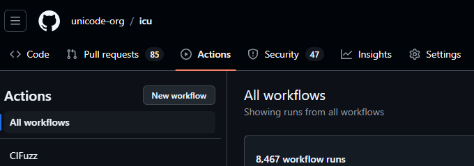
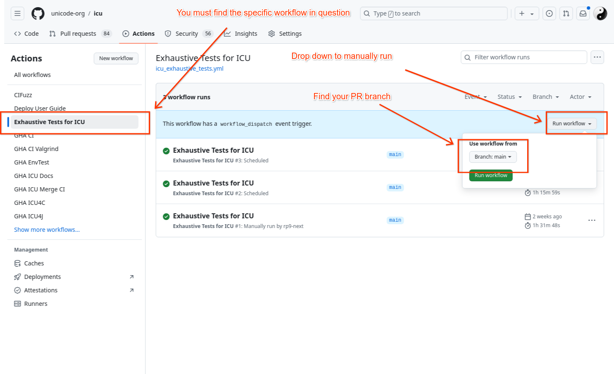

# Continuous Integration
{: .no_toc }

## Contents
{: .no_toc .text-delta }

1. TOC
{:toc}

---

<!--
© 2024 and later: Unicode, Inc. and others.
License & terms of use: http://www.unicode.org/copyright.html
-->

ICU is tested thoroughly through a variety of tests
(unit tests, integration tests, exhaustive tests, fuzzer tests).
Many tests are specific to ICU4C or ICU4J individually,
using the language specific testing setups tools
(ex: ICU4C's C++ `intltest` and C `cintltest` for unit tests,
ICU4J's unit tests in JUnit).

ICU uses Continuous Integration systems to run these tests automatically for each new code contribution,
and upon each update to a future contribution under development
(that is: for each [successful Pull Request merge, and upon a new push of new git commits to a Pull Request](../gitdev.md)).
ICU has GitHub Actions configured to run Continuous Integration testing.

Continuous Integration systems can also be used to regularly and automatically run other tasks besides testing.
ICU uses a CI workflow to automatically publish changes to its User Guide that is hosted on Github Pages.

## General ICU Settings for CI

### Automated Testing Enforcement

The value of automated testing isn't fully realized unless its enforcement is also automatic.

Individual tests can be configured in the ICU Github repository:

1. "Settings" tab for [`unicode-org/icu`](https://github.com/unicode-org/icu/)
2. "Branches"
3. "Branch protection rules"
4. Choose one of the rule sets and click "Edit".  ***Note: all rule sets should be changed in the same way***
5. Ensure that "Require status checks to pass before merging" is enabled
6. Underneath that enabled checkbox, the table "Status checks that are required." lists the currently enabled tests ("checks") that must pass before a Pull Request can be merged to the branch
7. Set the only required check to be `enforce-all-checks`.
    - The [`wait-for-checks` Github Action](https://github.com/marketplace/actions/wait-for-checks)
    correctly enforces that all checks of interest are passing,
    while only inspecting activated checks
    (ignoring checks that are inactive or skipped due to conditional triggering).
    - See the `enforce-all-checks` job of the `.github/workflows/wait-for-checks.yml` workflow for usage details.
    - For background info, see [this discussion](https://github.com/orgs/community/discussions/13690) for an explanation of the shortcoming in Github Actions currently that prompts the need for this solution.
8. If a new test (check) needs to be added, then update the regular expression in the `enforce-all-checks` job of the `.github/workflows/wait-for-checks.yml` workflow so that it will match on the name of the new check.
    - For checks defined in Github Actions,
    the name of the check is the name of the job.
    In GHA workflows, if the job name is not explicitly overridden,
    then the name falls back to the job identifier as written in the workflow file.

## Github Actions

ICU uses [Github Actions](https://github.com/features/actions) to run unit tests, environment tests, deployments of the User Guide, etc.

### Workflow files

Workflow files are in YAML form stored at `.github/workflows/`.

### UI Dashboard

All workflow instances/runs show up in the ["Actions" tab](https://github.com/unicode-org/icu/actions) of the repository,
using the display name that was set for the workflow.
All of the runs can be filtered by the Workflow name and/or by the Pull Request (via the Branch filter).

Each PR will show the status of the current/latest run of each job in the "Checks" section of the Pull Request's main page (Conversation tab), 
with special details and logs being navigable in the Checks tab.

### Configuration

#### Jobs

Jobs can be added, removed, and edited merely by editing the YAML workflow files.

#### Conditional Triggers

Workflow files can be conditionally triggered based on many factors.
A few of the useful factors:

* whether the trigger event is a push to a pull request, or the merge of a pull request, or a manual request
* the name of the originating branch for the trigger event
* whether the files modified in a pull request belong to certain file paths

ICU uses the file path matching condition to run ICU4J or ICU4C tests respectively only when their corresponding directories `icu4j` and `icu4c` contain file changes.
Thus, there is a separate workflow for ICU4J and ICU4C,
each with its own separate set of trigger conditions based on their corresponding file paths.
User Guide deployments are similarly run conditionally only when the `docs` directory has changed.
Some tests that are commonly needed or cross boundaries of concern are always run.

Some long-running tests are run once a week using a cronjob-like schedule trigger.

Some workflows exist to interact with the Github Actions platform,
such as keeping the cache alive for Maven artifacts due to the [noticeable flakiness that PRs face](https://docs.github.com/en/actions/using-workflows/caching-dependencies-to-speed-up-workflows) without the cache.
Because of a [cache eviction policy](https://docs.github.com/en/actions/using-workflows/caching-dependencies-to-speed-up-workflows#usage-limits-and-eviction-policy), which affects any subsequent PRs until they are merged,
it is easier to keep the cache alive in an automated way using a cronjob-like schedule trigger whose repetition period is shorter than the eviction period.

### Caveats

Github branch protection rules are not capable of appropriately handling jobs from a conditionally triggered workflow.
In other words, we cannot currently configure the required checks to include a job from the ICU4J workflow,
because if a PR does not include ICU4J code changes,
the workflow will not run and Github is not capable of ignoring the check in that scenario. Furthermore, workflow conditional triggers can only be triggered at the workflow level, not the job level.

Open Source users can now access machines with [at least 4 cores available per job](https://github.blog/2024-01-17-github-hosted-runners-double-the-power-for-open-source/).

### Exhaustive Tests
Exhaustive tests run tests on a larger, more complete dataset than the regular unit tests.
The larger dataset makes them run much longer than an individual unit test.
Thus, exhaustive tests are not run automatically on every PR.
They must pass before new versions of CLDR can be integrated into ICU,
which is a part of the release process.

It may be desirable to run exhaustive tests manually on a PR for areas of code that are known to need the extra test coverage provided by exhaustive tests.
To trigger exhaustive tests manually:

1. Go to your respective fork of the project (username/icu) if the PR is not already merged. Otherwise, go to https://github.com/unicode-org/icu
2. Select on the "Actions" tab from the top bar
    
3. On the left pane under All workflows, find "Exhaustive Tests for ICU" and click on run workflow, select branch and click 'Run workflow'.
    
