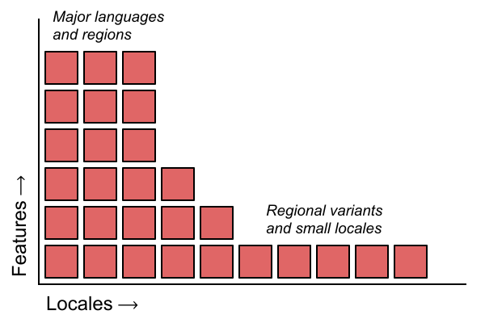

<!--
© 2019 and later: Unicode, Inc. and others.
License & terms of use: http://www.unicode.org/copyright.html
-->

ICU Data Build Tool
===================

ICU 64 provides a tool for configuring your ICU locale data file with finer
granularity.  This page explains how to use this tool to customize and reduce
your data file size.

## Overview: What is in the ICU data file?

There are hundreds of **locales** supported in ICU (including script and
region variants), and ICU supports many different **features**.  For each
locale and for each feature, data is stored in one or more data files.

Those data files are compiled and then bundled into a `.dat` file called
something like `icudt64l.dat`, which is little-endian data for ICU 64. This
dat file is packaged into the `libicudata.so` on Linux or `libicudata.dll.a`
on Windows. In ICU4J, it is bundled into a jar file named `icudata.jar`.

At a high level, the size of the ICU data file corresponds to the
cross-product of locales and features, except that not all features require
locale-specific data, and not all locales require data for all features. The
data file contents can be approximately visualized like this:

The `icudt64l.dat` file is 27 MiB uncompressed and 11 MiB gzipped.  This file
size is too large for certain use cases, such as bundling the data file into a
smartphone app or an embedded device.  This is something the ICU Data Build
Tool aims to solve.

## ICU Data Configuration File

The ICU Data Build Tool enables you to write a configuration file that
specifies what features and locales to include in a custom data bundle.

The configuration file may be written in either [JSON](http://json.org/) or
[Hjson](https://hjson.org/).  To build ICU4C with custom data, set the
`ICU_DATA_FILTER_FILE` environment variable when running `runConfigureICU` on
Unix or when building the data package on Windows.  For example:

    ICU_DATA_FILTER_FILE=filters.json path/to/icu4c/source/runConfigureICU Linux

The ICU Data Build Tool will work out of the box with a default Python
installation.  In order to use Hjson syntax, the `hjson` pip module must be
installed on your system.  You should also consider installing the
`jsonschema` module to print messages when errors are found in your config
file.

    $ pip3 install --user hjson jsonschema

To build ICU4J with custom data, you must first build ICU4C with custom data
and then generate the JAR file.  For more information, read
[icu4j-readme.txt](https://github.com/unicode-org/icu/blob/master/icu4c/source/data/icu4j-readme.txt).

### Locale Slicing

The simplest way to slice ICU data is by locale.  The ICU Data Build Tool
makes it easy to select your desired locales to suit a number of use cases.

#### Filtering by Language Only

Here is a *filters.json* file that builds ICU data with support for English,
Chinese, and German, including *all* script and regional variants for those
languages:

    {
      "localeFilter": {
        "filterType": "language",
        "whitelist": [
          "en",
          "de",
          "zh"
        ]
      }
    }

The *filterType* "language" only supports slicing by entire languages.

#### Filtering by Locale

For more control, use *filterType* "locale".  Here is a *filters.hjson* file that
includes the same three languages as above, including regional variants, but
only the default script (e.g., Simplified Han for Chinese):

    localeFilter: {
      filterType: locale
      whitelist: [
        en
        de
        zh
      ]
    }

#### Adding Script Variants (includeScripts = true)

You may set the *includeScripts* option to true to include all scripts for a
language while using *filterType* "locale".  This results in behavior similar
to *filterType* "language".  In the following JSON example, all scripts for
Chinese are included:

    {
      "localeFilter": {
        "filterType": "locale",
        "includeScripts": true,
        "whitelist": [
          "en",
          "de",
          "zh"
        ]
      }
    }

If you wish to explicitly list the scripts, you may put the script code in the
locale tag in the whitelist, and you do not need the *includeScripts* option
enabled.  For example, in Hjson, to include Han Traditional ***but not Han
Simplified***:

    localeFilter: {
      filterType: locale
      whitelist: [
        en
        de
        zh_Hant
      ]
    }

Note: the option *includeScripts* is only supported at the language level;
i.e., in order to include all scripts for a particular language, you must
specify the language alone, without a region tag.

#### Removing Regional Variants (includeChildren = false)

If you wish to enumerate exactly which regional variants you wish to support,
you may use *filterType* "locale" with the *includeChildren* setting turned to
false.  The following *filters.hjson* file includes English (US), English
(UK), German (Germany), and Chinese (China, Han Simplified), as well as their
dependencies, *but not* other regional variants like English (Australia),
German (Switzerland), or Chinese (Taiwan, Han Traditional):

    localeFilter: {
      filterType: locale
      includeChildren: false
      whitelist: [
        en_US
        en_GB
        de_DE
        zh_CN
      ]
    }

Including dependencies, the above filter would include the following data files:

- root.txt
- en.txt
- en_US.txt
- en_001.txt
- en_GB.txt
- de.txt
- de_DE.txt
- zh.txt
- zh_Hans.txt
- zh_Hans_CN.txt
- zh_CN.txt

### File Slicing (coarse-grained features)

ICU provides a lot of features, of which you probably need only a small subset
for your application.  Feature slicing is a powerful way to prune out data for
any features you are not using.

***CAUTION:*** When slicing by features, you must manually include all
dependencies.  For example, if you are formatting dates, you must include not
only the date formatting data but also the number formatting data, since dates
contain numbers.  Expect to spend a fair bit of time debugging your feature
filter to get it to work the way you expect it to.

The data for many ICU features live in individual files.  The ICU Data Build
Tool puts puts similar *types* of files into categories.  The following table
summarizes the ICU data files and their corresponding features and categories:

| Feature | Category ID(s) | Data Files   ([icu4c/source/data](https://github.com/unicode-org/icu/tree/master/icu4c/source/data)) | Resource Size   (as of ICU 64) |
|---|---|---|---|
| Break Iteration | `"brkitr_rules"`   `"brkitr_dictionaries"`   `"brkitr_tree"` | brkitr/rules/\*.txt   brkitr/dictionaries/\*.txt   brkitr/\*.txt | 522 KiB   **2.8 MiB**   14 KiB |
| Charset Conversion | `"conversion_mappings"` | mappings/\*.ucm | **4.9 MiB** |
| Collation   *[more info](#collation-ucadata)* | `"coll_ucadata"`   `"coll_tree"` | in/coll/ucadata-\*.icu   coll/\*.txt | 511 KiB   **2.8 MiB** |
| Confusables | `"confusables"` | unidata/confusables\*.txt | 45 KiB |
| Currencies | `"misc"`   `"curr_supplemental"`   `"curr_tree"` | misc/currencyNumericCodes.txt   curr/supplementalData.txt   curr/\*.txt | 3.1 KiB   27 KiB   **2.5 MiB** |
| Language Display   Names | `"lang_tree"` | lang/\*.txt | **2.1 MiB** |
| Language Tags | `"misc"` | misc/keyTypeData.txt   misc/likelySubtags.txt   misc/metadata.txt | 6.8 KiB   53 KiB   33 KiB |
| Normalization | `"normalization"` | in/\*.nrm except in/nfc.nrm | 160 KiB |
| Plural Rules | `"misc"` | misc/pluralRanges.txt   misc/plurals.txt | 3.3 KiB   33 KiB |
| Region Display   Names | `"region_tree"` | region/\*.txt | **1.1 MiB** |
| Rule-Based   Number Formatting   (Spellout, Ordinals) | `"rbnf_tree"` | rbnf/\*.txt | 538 KiB |
| StringPrep | `"stringprep"` | sprep/\*.txt | 193 KiB |
| Time Zones | `"misc"`   `"zone_tree"` | misc/metaZones.txt   misc/timezoneTypes.txt   misc/windowsZones.txt   misc/zoneinfo64.txt   zone/\*.txt | 41 KiB   20 KiB   22 KiB   151 KiB   **2.7 MiB** |
| Transliteration | `"translit"` | translit/\*.txt | 685 KiB |
| Unicode Character   Names | `"unames"` | in/unames.icu | 269 KiB |
| Unicode Text Layout | `"ulayout"` | in/ulayout.icu | 14 KiB |
| Units | `"unit_tree"` | unit/\*.txt | **1.7 MiB** |
| **OTHER** | `"cnvalias"`   `"misc"`   `"locale_tree"` | mappings/convrtrs.txt   misc/dayPeriods.txt   misc/genderList.txt   misc/numberingSystems.txt   misc/supplementalData.txt   locales/\*.txt | 63 KiB   19 KiB   0.5 KiB   5.6 KiB   228 KiB   **2.4 MiB** |

#### Filter Types

You may list *filters* for each category in the *featureFilters* section of
your config file.  What follows are examples of the possible types of filters.

##### Exclusion Filter

To exclude an entire category, use *filterType* "exclude".  For example, to
exclude all confusables data:

    featureFilters: {
      confusables: {
        filterType: exclude
      }
    }

##### File Name Filter

To exclude certain files out of a category, use the file name filter, which is
the default type of filter when *filterType* is not specified.  For example,
to include the Burmese break iteration dictionary but not any other
dictionaries:

    featureFilters: {
      brkitr_dictionaries: {
        whitelist: [
          burmesedict
        ]
      }
    }

Do *not* include directories or file extensions.  They will be added
automatically for you.  Note that all files in a particular category have the
same directory and extension.

You can use either a whitelist or a blacklist for the file name filter.

##### Regex Filter

To exclude filenames matching a certain regular expression, use *filterType*
"regex".  For example, to reject the CJK-specific break iteration rules:

    featureFilters: {
      brkitr_rules: {
        filterType: regex
        blacklist: [
          ^.*_cj$
        ]
      }
    }

The Python standard library [*re*
module](https://docs.python.org/3/library/re.html) is used for evaluating the
regular expressions.  In case the regular expression engine is changed in the
future, however, you are encouraged to restrict yourself to a simple set of
regular expression operators.

As above, do not include directories or file extensions, and you can use
either a whitelist or a blacklist.

##### Union Filter

You can combine the results of multiple filters with *filterType* "union".
This filter matches files that match *at least one* of the provided filters.
The syntax is:

    {
      filterType: union
      unionOf: [
        { /* filter 1 */ },
        { /* filter 2 */ },
        // ...
      ]
    }

This filter type is useful for combining "locale" filters with different
includeScripts or includeChildren options.

#### Locale-Tree Categories

Several categories have the `_tree` suffix.  These categories are for "locale
trees": they contain locale-specific data.  ***The [localeFilter configuration
option](#slicing-data-by-locale) sets the default file filter for all `_tree`
categories.***

If you want to include different locales for different locale file trees, you
can override their filter in the *featureFilters* section of the config file.
For example, to include only Italian data for currency symbols *instead of*
the common locales specified in *localeFilter*, you can do the following:

    featureFilters:
      curr_tree: {
        filterType: locale
        whitelist: [
          it
        ]
      }
    }

You can exclude an entire `_tree` category without affecting other categories.
For example, to exclude region display names:

    featureFilters: {
      region_tree: {
        filterType: exclude
      }
    }

Note that you are able to use any of the other filter types for `_tree`
categories, but you must be very careful that you are including all of the
correct files.  For example, `en_GB` requires `en_001`, and you must always
include `root`.  If you use the "language" or "locale" filter types, this
logic is done for you.

### Resource Bundle Slicing (fine-grained features)

The third section of the ICU filter config file is *resourceFilters*.  With
this section, you can dive inside resource bundle files to remove even more
data.

You can apply resource filters to all locale tree categories as well as to
categories that include resource bundles, such as the `"misc"` category.

For example, consider measurement units.  There is one unit file per locale (example:
[en.txt](https://github.com/unicode-org/icu/blob/master/icu4c/source/data/unit/en.txt)),
and that file contains data for all measurement units in CLDR.  However, if
you are only formatting distances, for example, you may need the data for only
a small set of units.

Here is how you could include units of length in the "short" style but no
other units:

    resourceFilters: [
      {
        categories: [
          unit_tree
        ]
        rules: [
          -/units
          -/unitsNarrow
          -/unitsShort
          +/unitsShort/length
        ]
      }
    ]

Conceptually, the rules are applied from top to bottom.  First, all data for
all three styes of units are removed, and then the short length units are
added back.

#### Wildcard Character

You can use the wildcard character (`*`) to match a piece of the resource
path.  For example, to include length units for all three styles, you can do:

    resourceFilters: [
      {
        categories: [
          unit_tree
        ]
        rules: [
          -/units
          -/unitsNarrow
          -/unitsShort
          +/*/length
        ]
      }
    ]

The wildcard must be the only character in its path segment. Future ICU
versions may expand the syntax.

#### Resource Filter for Specific File

The resource filter object takes an optional *files* setting which accepts a
file filter in the same syntax used above for file filtering.  For example, if
you wanted to apply a filter to misc/supplementalData.txt, you could do the
following (this example removes calendar data):

    resourceFilters: [
      {
        categories: ["misc"]
        files: {
          whitelist: ["supplementalData"]
        }
        rules: [
          -/calendarData
        ]
      }
    ]

#### Combining Multiple Resource Filter Specs

You can also list multiple resource filter objects in the *resourceFilters*
array; the filters are added from top to bottom.  For example, here is an
advanced configuration that includes "mile" for en-US and "kilometer" for
en-CA; this also makes use of the *files* option:

    resourceFilters: [
      {
        categories: ["unit_tree"]
        rules: [
          -/units
          -/unitsNarrow
          -/unitsShort
        ]
      },
      {
        categories: ["unit_tree"]
        files: {
          filterType: locale
          whitelist: ["en_US"]
        }
        rules: [
          +/*/length/mile
        ]
      },
      {
        categories: ["unit_tree"]
        files: {
          filterType: locale
          whitelist: ["en_CA"]
        }
        rules: [
          +/*/length/kilometer
        ]
      }
    ]

The above example would give en-US these resource filter rules:

    -/units
    -/unitsNarrow
    -/unitsShort
    +/*/length/mile

and en-CA these resource filter rules:

    -/units
    -/unitsNarrow
    -/unitsShort
    +/*/length/kilometer

In accordance with *filterType* "locale", the parent locales *en* and *root*
would get both units; this is required since both en-US and en-CA may inherit
from the parent locale:

    -/units
    -/unitsNarrow
    -/unitsShort
    +/*/length/mile
    +/*/length/kilometer

## Other Features of the ICU Data Build Tool

While data filtering is the primary reason the ICU Data Build Tool was
developed, there are there are additional use cases.

### Running Data Build without Configure/Make

You can build the dat file outside of the ICU build system by directly
invoking the Python buildtool.  Run the following command to see the help text
for the CLI tool:

    $ PYTHONPATH=path/to/icu4c/source/data python3 -m buildtool --help

### Collation UCAData

For using collation (sorting and searching) in any language, the "root"
collation data file must be included. It provides the Unicode CLDR default
sort order for all code points, and forms the basis for language-specific
tailorings as well as for custom collators built at runtime.

There are two versions of the root collation data file:

- ucadata-unihan.txt (compiled size: 511 KiB)
- ucadata-implicithan.txt (compiled size: 178 KiB)

The unihan version sorts Han characters in radical-stroke order according to
Unicode, which is a somewhat useful default sort order, especially for use
with non-CJK languages.  The implicithan version sorts Han characters in the
order of their Unicode assignment, which is similar to radical-stroke order
for common characters but arbitrary for others.  For more information, see
[UTS #10 §10.1.3](https://www.unicode.org/reports/tr10/#Implicit_Weights).

By default, the unihan version is used.  The unihan version of the data file
is much larger than that for implicithan, so if you need collation but also
small data, then you may want to select the implicithan version.  To use the
implicithan version, pass the following command line argument to buildtool:

    --collation_ucadata=implicithan

To pass this argument when using configure/make or Windows makedata.mak, set
it in the `ICU_DATA_BUILDTOOL_OPTS` environment variable:

    ICU_DATA_BUILDTOOL_OPTS="--collation_ucadata=implicithan"

### File Substitution

Using the configuration file, you can perform whole-file substitutions.  For
example, suppose you want to replace the transliteration rules for
*Zawgyi_my*.  You could create a directory called `my_icu_substitutions`
containing your new `Zawgyi_my.txt` rule file, and then put this in your
configuration file:

    fileReplacements: {
      directory: "/path/to/my_icu_substitutions"
      replacements: [
        {
          src: "Zawgyi_my.txt"
          dest: "translit/Zawgyi_my.txt"
        }
      ]
    }

Whole-file substitution happens before all other filters are applied.
